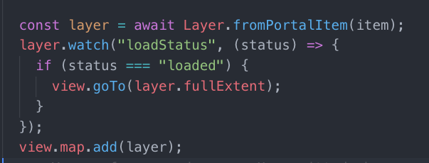
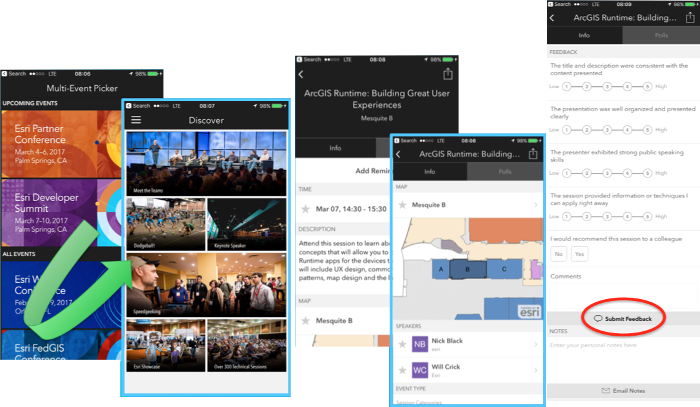

<!-- .slide: data-background="../reveal.js/img/bg-1.png" -->
<!-- .slide: class="title" -->
 
 
 
### Building Web Apps that Integrate with Your Portal
 
 Heather Gonzago and Kelly Hutchins

----

### Agenda

- Portal Overview
- Build an app
  - Handle authentication
  - Display Web Map or Web Scene
  - Connect to Portal
  - Get and display content from Portal
  - Add layers to map
  - Add widgets
- Tools & Resources

----
### **Advantages of working with AGO/Portal**

 

- Sharing and managing secure resources
- Data hosting
- Easy to leverage
- Less code
- Reusable
- Organize/Update content centrally 

----
### **Architecture: Apps + Content**

 

----
### SDK Resources

- <a href="https://developers.arcgis.com/javascript/latest/guide/working-with-platform/index.html" target="_blank">
Guide topic
</a>
 
- <a href="https://developers.arcgis.com/javascript/latest/sample-code/intro-widgets/index.html?search=Portal">Samples</a>

----
### Step 1: Setup Authentication
* <a href="https://developers.arcgis.com/javascript/latest/api-reference/esri-identity-IdentityManager.html#registerOAuthInfos" target="_blank">Register the app</a>
<pre style="display:inline-block; padding: 5px; margin: 10px auto; width: 100%;"><code data-trim> 
// Create OAuthInfo
  var oauthInfo = new OAuthInfo({
    appId: "enterAppIdHere" // registered app id on AGO
  });
esriId.registerOAuthInfos([oauthInfo]); 
</code></pre>
 
* <a href="https://developers.arcgis.com/javascript/latest/api-reference/esri-identity-IdentityManager.html#getCredential" target="_blank">Sign in and get credential</a>
 
<pre style="display:inline-block; padding: 5px; margin: 10px auto; width: 100%;"><code data-trim> 
  credential = await IdentityManager.getCredential(portalUrl);
</code></pre>
 
* <a href="https://developers.arcgis.com/javascript/latest/api-reference/esri-identity-IdentityManager.html#getCredential" target="_blank">Sign out and destroy credentials</a>
 
<pre style="display:inline-block; padding: 5px; margin: 10px auto; width: 100%;"><code data-trim> 
IdentityManager.destroyCredentials();
</code></pre>

----

### Register an app
- <a href="https://www.arcgis.com" target="_blank">ArcGIS Online</a>
- <a href="https://developers.arcgis.com/applications" target="_blank">ArcGIS for Developers site</a>
 

----
### **OAuth2: Identity Manager**
- Authentication functionality provided via the Identity Manager
- Handles the complexity of calling endpoints and parsing tokens
- Example: JS API Identity Manager
  - `OAuthInfo` class -> pass in registered `App ID`
  - Pass this information to the Identity Manager

----
### Authentication
* <a href="https://developers.arcgis.com/javascript/latest/api-reference/esri-identity-IdentityManager.html#checkSignInStatus">checkSignInStatus</a>
<pre style="display:inline-block; padding: 5px; margin: 10px auto; width: 100%;"><code data-trim> 
//  Is the user already logged in?
IdentityManager.checkSignInStatus(portalUrl).always((info) => {
  ..  
});
</code></pre>
* returns <a href="https://developers.arcgis.com/javascript/latest/api-reference/esri-identity-Credential.html#">Credential</a>
----
###  Unique identifiers

Note: All portal content has a unique identifier
----

### Step 2: Display a map (todo update with new demo link when done)
* <a href="https://developers.arcgis.com/javascript/latest/api-reference/esri-WebMap.html" target="_blank">2D:esri/WebMap</a>
* <a href="https://developers.arcgis.com/javascript/latest/api-reference/esri-WebScene.html" target="_blank">3D:esri/WebScene</a>
<pre style="display:inline-block; padding: 5px; margin: 10px auto; width: 100%;"><code data-trim>
// Step 2 create simple 3d (or 2d map)
const map = new WebMap({
  portalItem: {
    id: "7761d81ff08e45f2a7f27997e8d3e92d"
  }
});
const view = new SceneView({
  map,
  zoom: 4,
  center: [-98, 35],
  container: "viewDiv"
});
</pre></code>

----

### Bookmarks and Slides

- [Bookmarks](https://developers.arcgis.com/javascript/latest/sample-code/widgets-bookmarks/index.html)
- [Slides](https://developers.arcgis.com/javascript/latest/sample-code/webscene-slide-tour/index.html)

Note: Web maps and scenes have additional info we can access like bookmarks and slides

----

### Step 3: Connect to Portal
 
- View of the portal
- authMode  <pre>anonymous|auto|immediate</pre>

<pre class="small" style="float:right;">
<code>
const portal = new Portal();
portal.authMode = "immediate";
portal.load().then(function(){});

</code></pre>

Note:Connect to the portal to get a view of the portal from the current users perspective. If anonymous you['ll get the default view of theportal. If logged in the info will be specific to the organization the user is a member of.

----

### Access Portal Properties

 

 - Details about the [portal](https://developers.arcgis.com/javascript/latest/api-reference/esri-portal-Portal.html)
 - Custom groups
 - Portal defaults like basemap, extent
 - [Helper services](https://jsapi.maps.arcgis.com/sharing/rest/portals/self?culture=en)

<pre class="med"><code>
   portal.load().then(function(){
     const orgName = portal.name;
     const basemapGallery = portal.basemapGalleryGroupQuery
     const defaultExtent = portal.defaultExtent;
  });
</code></pre>

Note: Get info about the portal including region, culture, name, thumbnail url and default properties like the basemap, extent and galleries

----

### Step 4a: Query portal content

- Portal.queryGroups(
- [Portal.queryItems()](https://developers.arcgis.com/javascript/latest/api-reference/esri-portal-Portal.html#queryItems)
- Portal.queryUsers()
- PortalGroup.queryItems()
- PortalUser.queryFavorites()

Note: Lots of methods available to easily query portal content. Get items, groups, users, favorites and more

----

### [PortalQueryParams](https://developers.arcgis.com/javascript/latest/api-reference/esri-portal-PortalQueryParams.html)
 

Note: Use portalQueryParams to refine the query. Code sample performs two queries and waits for results of both to
finish. queryItems takes in extent, owner name and list of layer types to return

----

### Step 4b: Display query results
PortalQueryResult
[Results](https://developers.arcgis.com/javascript/latest/api-reference/esri-portal-PortalQueryResult.html) returned from a portal query

Note: Loop through the returned results array and create an item in a select box for each layer

----
### Step 5a: Setup add layer click handler

----

### Step 5b: Add layer to map

* Layer.fromPortalItem
* Zoom to layer when ready

----

### Step 6: Add widgets

- Basemap Gallery
 

 
- Search
 

Note: Pass in portal to some widgets to get portal defaults. In this example we'll get search locators and the basemap group
----

### MISC: Portal Rest API via `esriRequest`

[ArcGIS REST API](https://developers.arcgis.com/rest/users-groups-and-items/working-with-users-groups-and-items.htm)

[DEMO](Demos/PortalAPISample.html)
----

### MISC: Access credit-based services

- Application handles it for you, no need to sign in
- Proxy file with saved credentials
  - Hosted proxy file provided by Esri OR
  - Host your own proxy file
  - Esri proxy -> https://github.com/Esri/resource-proxy
    - DotNet, JSP, and PHP

----

### **Tools: AGO Assistant**

----

<!-- .slide: data-background="../reveal.js/img/bg-rating.jpg" -->

## Questions?

**Help us to improve** by filling out the survey

----
